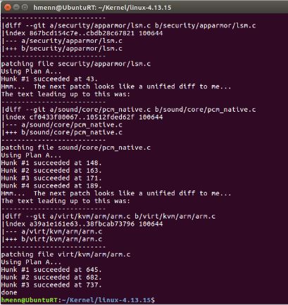
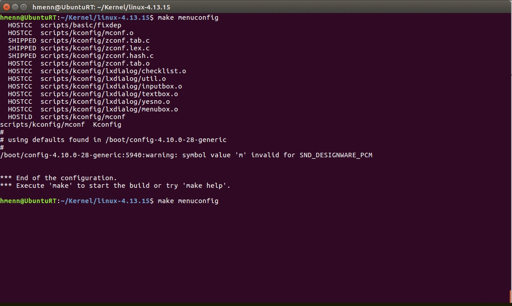
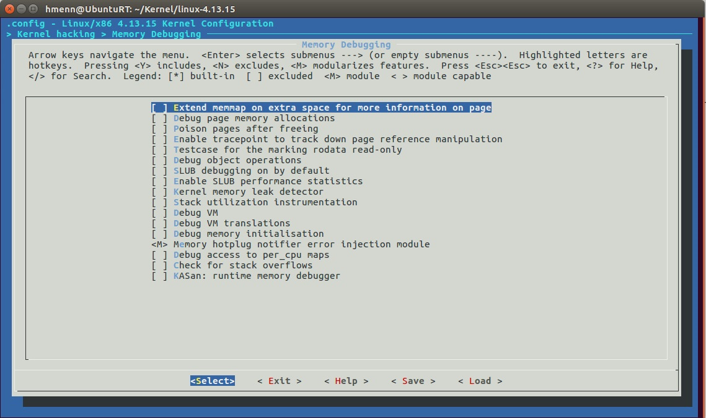

# How to install Real Time Kernel patch on Linux(Ubuntu 16.04)

1. Install Ubuntu on Virtual box or Real hardware.
2. Download a kernel
    ```
    https://www.kernel.org/
    ```
    * What means Number/version 4.13.15  
        * 4: Kernel version
        * 13: Major revision
        * 15: Minor revision
    * ! Kernel version and major revision number must be the same.
    * Create Kernel directory and download kernel source into the directory.
    ```
    mkdir Kernel && cd Kernel
    wget https://cdn.kernel.org/pub/linux/kernel/v4.x/linux-4.13.15.tar.xz
    ```
3. Download RT-Patch into the Kernel directory.
    ```
    https://wiki.linuxfoundation.org/realtime/preempt_rt_versions
    https://cdn.kernel.org/pub/linux/kernel/projects/rt/4.13/
    ```
    Download it
    ```
    wget https://cdn.kernel.org/pub/linux/kernel/projects/rt/4.13/patch-4.13.13-rt5.patch.gz
    ```
 4. Extract Kernel source and patch it.
    ```
    tar xvf linux-4.13.15.tar.xz
    cd linux-4.13.15
    ```
    Patch it
    ```
    gzip -cd ../patch-4.13.13-rt5.patch.gz | patch -p1 --verbose
    ```
    
5. Install libncurses5-dev and libssl-dev to enable real time processing and compiling packages.
    ```
    sudo apt-get install libncurses5-dev
    sudo apt-get install libssl-dev
    ```
6. Configure Makefile before compiling kernel. This configure will open Real time preemt options.
    ```
    make menuconfig
    ```
    Select Fully Preemtible Kernel otion  from 
    1. Processor type and features
    2. Preemption Model (Voluntary Kernel Preemption (Desktop))
    3. Fully Preemptible Kernel (RT)  
        

    Go upper menu with ESC-ESC key.
    Deselect stack overflows if selected.
    1. Kernel hacking --> [Enter]
    2. Memory Debugging [Enter]
    3. Check for stack overflows
        
    Go upper menu and save(RIGHT_ARROW) .config file.
    
7. Compile Kernel source file
    ```
    make
    ```
    NOTE: You can use "make -jX"  option if you have thread support. X is number of core + 1. It will compile faster. For Virtual_Box use this.
    ```
    make -j2
    ```
    Wait until compilation dones. It can take 3-4 hour. 